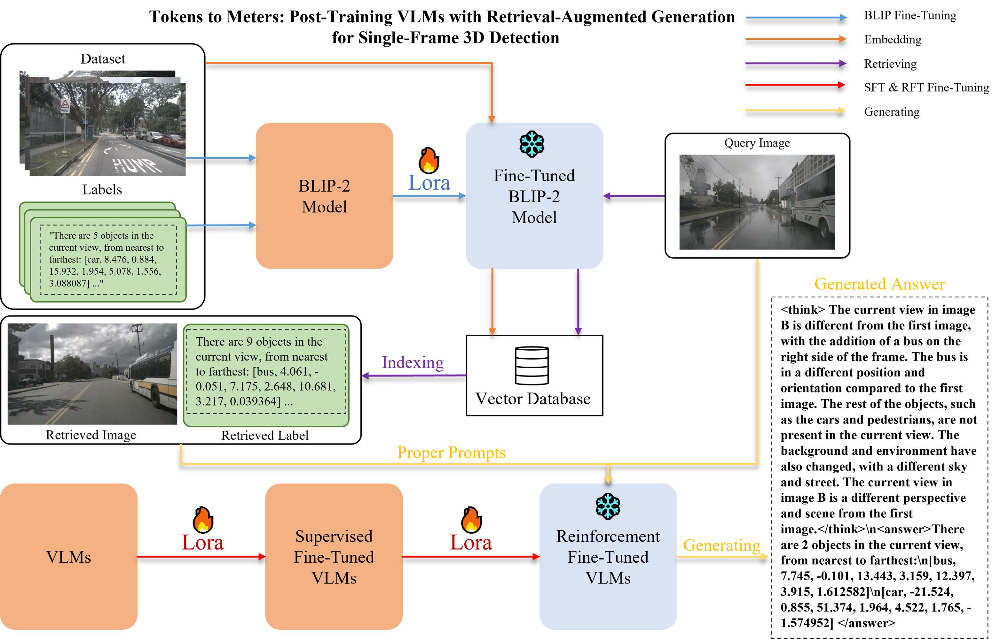

# Tokens2Meters

Post-Training VLMs with Retrieval-Augmented Generation for Single-Frame 3D Detection.



## Project Structure

```
Tokens2Meters/
├── src/                   # Source code directory
│   ├── data/              # Data processing and template generation
│   ├── eval/              # Evaluation scripts and utilities
│   ├── rag/               # RAG (Retrieval-Augmented Generation) components
│   ├── rl/                # Reinforcement learning training scripts
│   └── sft/               # Supervised fine-tuning scripts
├── adapter/               # Model adapters and checkpoints
├── imgs/                  # Image assets and visualizations
├── models/                # Qwen/Blip models
├── output/                # finutune adapter
├── dataset/               # nuScenes and QA
├── requirements.txt       # Python dependencies
├── rootpath.py            # project root path
└── README.md              # Project documentation
```

## Setup

### 1. Clone the repository
```bash
git clone https://github.com/ycma8/Tokens2Meters.git
cd Tokens2Meters
```

### 2. Install dependencies
```bash
conda create -n t2m python=3.12 cuda-toolkit
conda activate t2m
pip install -r requirements.txt
```

### 3. Configure data paths
```bash
export PYTHONPATH=Path_To_Tokens2Meters
```
### 4. Prepare datasets
Place your NuScenes dataset in the configured data directory and run:
```bash
python src/data/data_template.py
python src/data/split.py
```

## Usage

### Data Processing
```bash
# Generate data templates
python src/data/data_template.py

# Split datasets
python src/data/split.py
```

### Training
```bash
# SFT training
python src/sft/train.py

# RL training(nothink)
python src/rl/train.py

# RL training(think)
python src/rl/train_think.py
```

### RAG
first download blip
```bash
cd models
pip install modelscope
modelscope download --model cubeai/blip-image-captioning-base --local_dir ./blip
```
then finetune
```bash
python src/rag/blip_finetune/finetune_lora_nuscenes.py
```
create vector db
```bash
python src/rag/vector_db/insert_data.py
```
use vector db to create rag_eval.jsonl
```bash
python src/rag/vector_db/rag_eval.py
```
### Evaluation

evaluation:use vllm or llamafactory on dataset/nuscenes/rag_eval.jsonl

```bash
python src/eval/eval_center.py(or other metrics)
```
